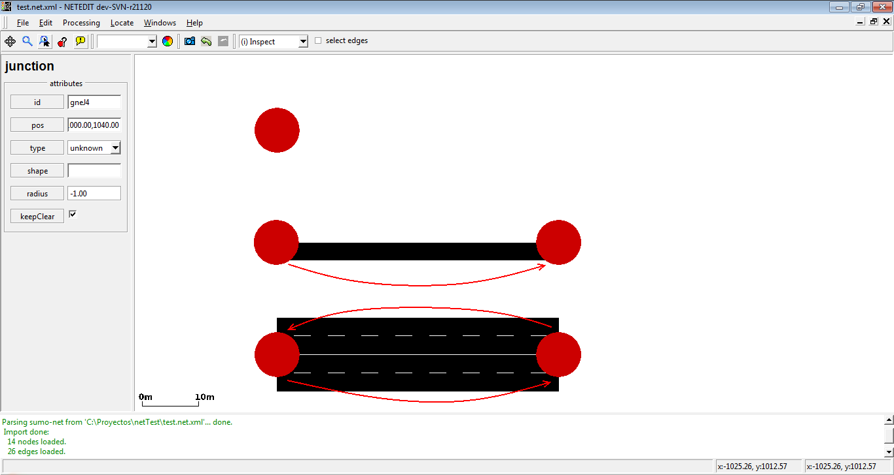
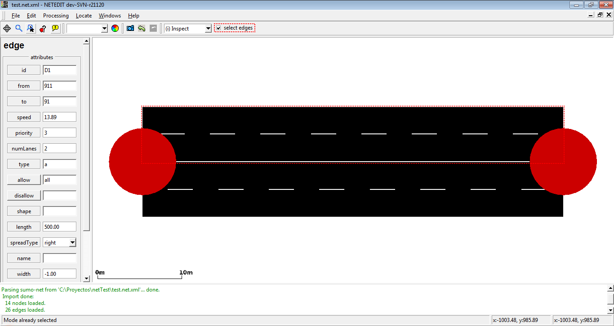
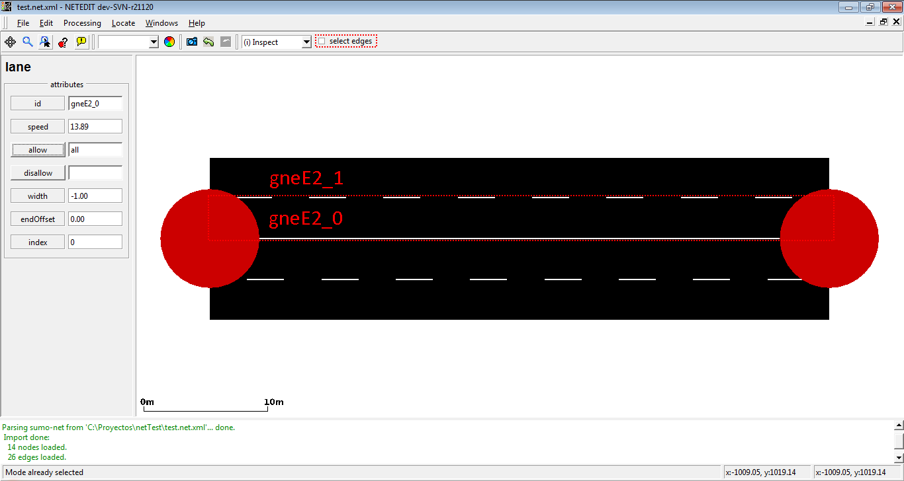
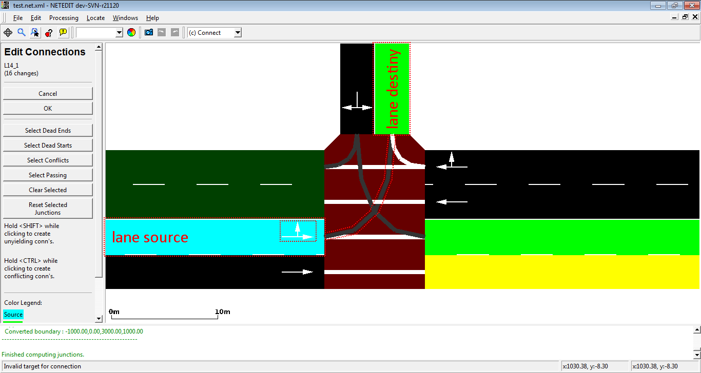
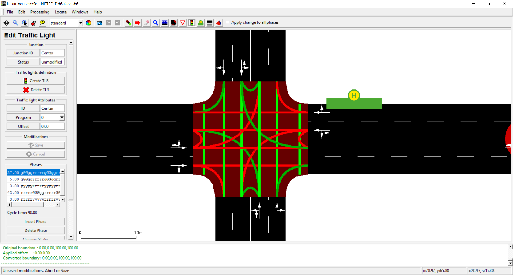

# Network Elements

## Junctions

[Junctions](../Networks/PlainXML.md#node_descriptions), (also referred to as *Nodes*), represent intersections. A SUMO junction is equivalent to a Vertex in graph theory.

   
Example of different junctions

## Edges

In the SUMO-context, [edges](../Networks/PlainXML.md#edge_descriptions) represent roads or streets. Note that edges are unidirectional. It's equivalent to a edge in a graph theory.

   
Example of edge. Note that the box "select edge" is **checked**

## Lanes

Each SUMO edge is composed of a set of [lanes](../Networks/PlainXML.md#lane-specific_definitions) (At least one).

   
Example of lane. Note that the box "select edge" is **unchecked**

## Connections

[Connections](../Networks/PlainXML.md#connection_descriptions) describe how incoming and outgoing edges of junctions are connected (for example to prohibit left-turns at some junctions.

   
Example of connection between a source lane and a target lane

## Traffic Lights

A [traffic light program](../Networks/PlainXML.md#traffic_light_program_definition) defines the phases of a traffic light.

   
Example of Traffic light
