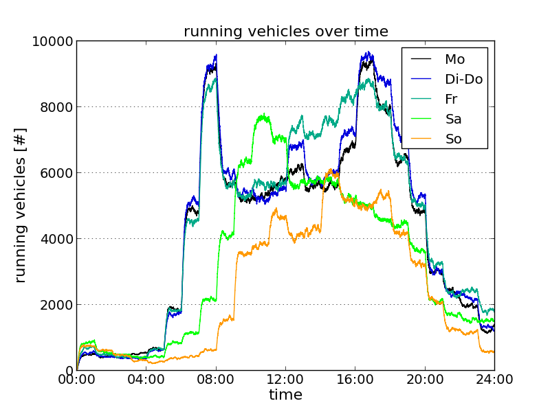

In the following, You will find some examples for plotting results
obtained from SUMO.

## Number of Vehicles within the Simulation over Time

Let's assume You want to show the number of vehicles running through
your simulation over time. You'll need the
[summary-output](../Simulation/Output/Summary.md) that contains the
number of vehicles within the simulation for each simulation time step.

If Your [summary-output](../Simulation/Output/Summary.md) is named
"summary.xml", You may show the number of running vehicles using

```
python plot_summary.py -i summary.xml
```

as `running`, the measurement You want to
plot, is the default. The following image will be shown:


Now, let's assume You want to compare the number of running vehicles
from different runs. The example below uses
[summary-outputs](../Simulation/Output/Summary.md) from runs that
cover different types of days of a week (mo\\summary.xml: Monday,
dido\\summary.xml: Tuesday-Tursday, etc.). As we want to show only a
single day, we limit the x-axis to \[0,86400\] (86400: seconds in a day)
using **--xlim 0,86400** and we also save the figure into the file
"summary_running_all.png" using **-o summary_running_all.png**. To know what is shown, we replace
the file names in the legend by the week day types using **-l Mo,Di-Do,Fr,Sa,So**.

```
python plot_summary.py -i mo\summary.xml,dido\summary.xml,fr\summary.xml,sa\summary.xml,so\summary.xml \
 -l Mo,Di-Do,Fr,Sa,So -o summary_running_all.png --xlim 0,86400
```


Ok, now we'll make it professional by adding labels and titles, proper
ticks, using a different format for the simulation time than seconds,
etc.

```
python plot_summary.py -i mo\summary.xml,dido\summary.xml,fr\summary.xml,sa\summary.xml,so\summary.xml \
 -l Mo,Di-Do,Fr,Sa,So --xlim 0,86400 --ylim 0,10000 -o sumodocs/summary_running.png --yticks 0,10001,2000,14 \
 --xticks 0,86401,14400,14 --xtime1 --ygrid --ylabel "running vehicles [#]" --xlabel "time" \
 --title "running vehicles over time" --adjust .14,.1
```



The [summary-output](../Simulation/Output/Summary.md) contains
further measures that can be visualised in the same way, among them
`loaded`, `inserted`, `waiting`, or `ended`. Please consult the
[summary-output](../Simulation/Output/Summary.md) documentation for
a complete list.

Further information can be found at:

- [summary-output](../Simulation/Output/Summary.md) documentation
- [visualisation tools](../Tools/Visualization.md) documentation